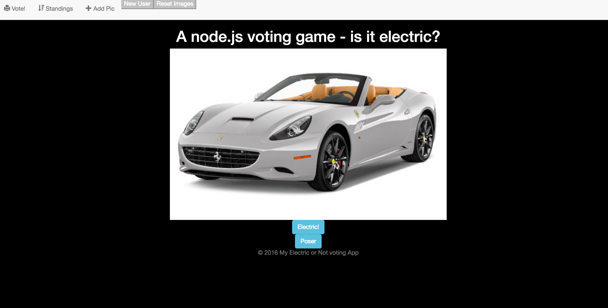

# Voting App Created with Express.js and Mongodb

Steps To Get Express up and Running
####1. Initialize with the Express.js generator. Run express command + name you want to name directory (mongo2)
```
--npm init
--npm install express --save
--express mongo2
--npm install
```
--This will create an entire folder structure with everything we need to get started making an express web (dub dub dub) application
####2. add a .gitignore file that will (at least) ignore everything inside of node_modules
#Perfect node modules are in this repo! Need to Review this step ;]
```
sudo vi .gitignore
```
This will enter vi text editor and create a .gitignore file to place our ignored files
```
node_modles/*
```
Shift ZZ will escape the vi editor with saving
--Reason to ignore this? If someone wants to run your app, they can do an npm install themselves. These modules should not be committed to the repisotry
unless there if very good reason. Don't want to clog up the repository. This is "best practice"
####3.Copy the compass boilerplate into the project
--This will give you access to compass. Need to change the ruby config file to write to the correct spot. 
This means changing the path of the css write to the directory to ../public/stylesheets
####4. Initialize git (the repo) or start it up in Github Desktop 
from the command line
```
--git init
--git add * (this will add ALL files in the direcotry to be committed)
--git commit -m "Init commit to github"
--git push/add origin/open up github desktop
```
####5. 
```
npm install ejs --save
```
####6.
```
npm install mongodb --save
```
--These two steps will get two more modules from the npm market for us to use in our app.
####7.
```
npm install
```
--This will install express, all its dependeies, etc. What is inside of package.json
####8. Sanity Check run nodemon
```
nodemon
```
####9. switch the templating engine (if desired) from Jade.
-- in app.js (where its at) go down to the app.set and change it from  .jade file to .ejs file
####9. switch the templating engine (if desired) from Jade.
-- in app.js (where its at) go down to the app.set and change it from  .jade file to .ejs file
####10. In index.ejs set up our common files and include them
-head
-header
-footer
//creates these files on the fly and serves them up
####11. Setup up a Wrapper div to hold our voting buttons and our image
####12. Style the Homepage (using Compass)
####13. Set up and test Mongo DB
####14. If you're this far - go to home page routes/index.js for next Steps..
